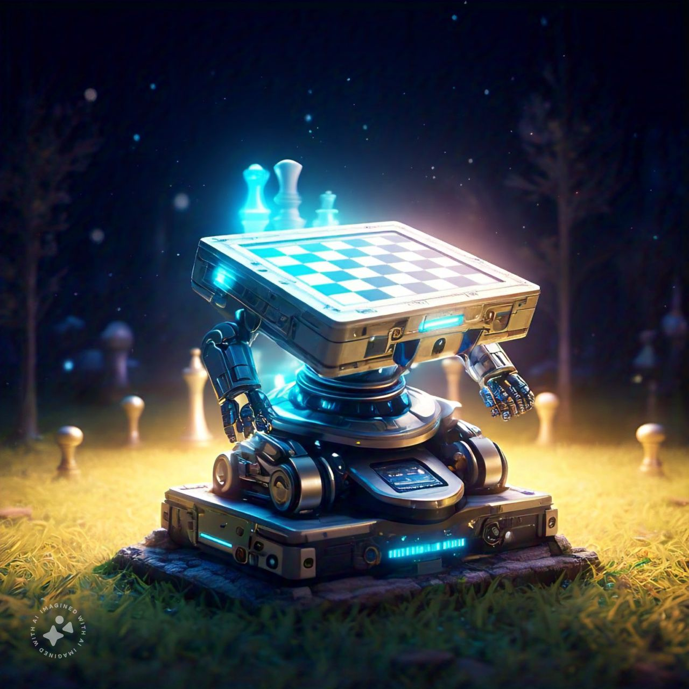
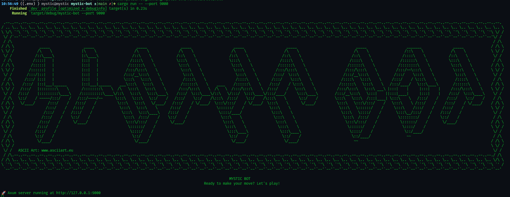

# Mystic Chess Bot

<p align="center">
 
</p>
  <p align="center">
    <a href="https://github.com/shashankp28/mystic-bot/actions">
      
    </a>
    <a href="https://github.com/shashankp28/mystic-bot/graphs/contributors">
      
    </a>
    <a href="https://github.com/shashankp28/mystic-bot/issues">
      
    </a>
    <a href="https://github.com/shashankp28/mystic-bot/pulls">
      
    </a>
    <a href="https://securityscorecards.dev/viewer/?uri=github.com/shashankp28/mystic-bot">
      
    </a>
    <br />
    <br />
  </p>
</p>

A **simple yet powerful Chess Bot** written in **Rust**, designed for efficiency and scalability.

The bot currently has an account on **Lichess**: [MysticBot](https://lichess.org/@/MysticBot).

> ⚠️ Note: The bot is **not running constantly** due to budget constraints.

## Getting Started

0. **Clone the Repository**  
   Start by cloning the repository to your local system:

   ```bash
   git clone https://github.com/shashankp28/mystic-bot.git
   ```

1. **Install Python Dependencies**  
   Ensure you have Python installed, then install the required dependencies:

   ```bash
   pip install -r requirements.txt
   ```

2. **Build the Bot Using Cargo**  
   Use **cargo** to build the bot for optimized performance:

   ```bash
   cd mystic-bot
   cargo build --release
   ```

3. **Run the Bot Independently**  
   After building, you can run the bot directly:

   ```bash
   cargo run  # or
   ./target/release/mystic-bot
   ```

   

   Sample _json_ files are give in the `sample/` directory

4. **Play Locally Using Jupyter Notebook**  
   If you prefer to play with the bot locally, use the Jupyter Notebook provided in `notebooks/botBattle.ipynb`.  
   The notebook is **self-explanatory** and offers an interactive way to play against the bot.

5. **Configure Lichess API Key**  
   To connect the bot to your Lichess account:
   - Open the `config.yml.default` file.
   - Replace the placeholder `xxxxxxxxxxxxxxxxxxxxxx` with your Lichess API key:
     ```yml
     token: "your_lichess_api_key"
     ```
   - Rename the file to `config.yml`:
     ```bash
     mv config.yml.default config.yml
     ```
   - Run the bot using the following command:
     ```bash
     python lichess-bot.py -u
     ```

Follow these steps to set up and enjoy playing with **Mystic Chess Bot**! ♟️✨

## Bot Overview

### 0. Bit-Board Representation

The bot uses a bit-board representation for storing the chessboard state, making computations efficient and fast. Below is a brief overview of the `Board` struct:

```rust
#[derive(Copy, Clone, Debug, Serialize, Deserialize)]
pub struct Board {
    // Flattended Matrix representation of 8x8 Chess Board, with `a1` at the Top-Left
    // Bit is 1 if the corresponding piece is at corresponding index else 0
    // The black and white parts of the boards are concatenated in 64+64 = 128 bits
    // The MSB part corresponds to black and LSB part corresponds to white
    // The below representation based on
    // Video: https://www.youtube.com/watch?v=w4FFX_otR-4&pp=ygUSbWFraW5nIGEgY2hlc3MgYm90
    pub rooks: u128,
    pub knights: u128,
    pub bishops: u128,
    pub queens: u128,
    pub kings: u128,
    pub pawns: u128,

    // 1 bit, whether the board has an en-passant
    // It is not possible for a board to have multiple en-passants at the same time!
    // ( [ X bits full move number ], [ 7 bits Half move clock ], is_white_move, en_passant_warn,
    //   [ 3 bits en_passant_column  ], Black o-o, Black o-o-o, White o-o, White o-o-o )
    //   --> 16 + fullmove_number / 32 bits used
    pub metadata: u32,

    // Will not be Hashed
    // [ 1 bit is_pawn_promotion ] [ 2 bits for Q, R, B, N promotion ],
    // [ 6 bits for source ] [ 6 bits for destination ] = 15 bits :D
    pub latest_move: u16
}
```

This representation is inspired by this [video](https://www.youtube.com/watch?v=w4FFX_otR-4&pp=ygUSbWFraW5nIGEgY2hlc3MgYm90).

### 1. Opening Database

- The bot uses an opening database containing **1.1 million+** chess positions.
- For the first few moves, the bot looks up this database to instantly play the best-known responses.
- This enables quick and accurate moves in the opening phase, saving computation time for later stages of the game.

### 2. Search Algorithm

The bot implements a search algorithm using a combination of:

- **Alpha-beta pruning**: Prunes unnecessary branches in the search tree.
- **Principal Variation Search (PVS)**: Optimizes the exploration of the search tree's principal variation.

Key features:

- Evaluates **300,000+** positions per second on average.
- Dynamically adjusts search depth:
  - **Midgames**: Searches to a depth of **5–6 moves**.
  - **Endgames**: Increases search depth to **9–10 moves**.
- **Think time**: **5 seconds per move** outside of the opening database.

### 3. Heuristics

The evaluation function combines:

- **Static piece values**: Assigns scores to pieces (e.g., Pawns, Knights, Bishops, etc.).
- **Positional values**: Evaluates the strategic placement of pieces on the board.

For reference, the scoring is inspired by this [website](https://www.chessprogramming.org/Piece-Square_Tables).

**_⚠️ Currently, the bot does not use neural networks and hence does not learn from games. Future work may include integrating a learning-based system to enhance performance._**

### 4. Future Enhancements

- **Neural Network Integration**: To enable adaptive learning and improve decision-making
- **Endgame Tablebases**: For perfect endgame play
- **Cross-Platform Support**: Ensuring compatibility across Windows, Linux, and macOS

## Contact

For any inquiries or support, feel free to reach out to me at: **shashankp2832@gmail.com**

## License

**Mystic Bot** is licensed under the **MIT License**.  
You can check out the full text of the MIT License in the [LICENSE file](https://github.com/shashankp28/mystic-bot/blob/main/LICENSE).

Additionally, this project may include code from [Lichess Bot](https://github.com/lichess-bot-devs/lichess-bot), which is also licensed under the AGPLv3.  
Please refer to the [Lichess Bot LICENSE](https://github.com/lichess-bot-devs/lichess-bot/blob/master/LICENSE) for more information.
